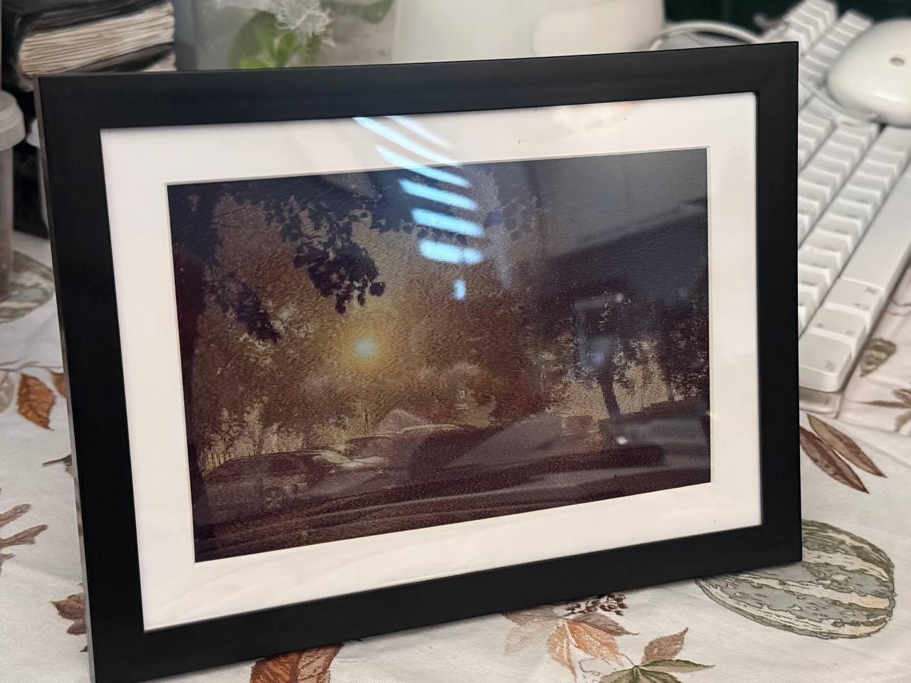
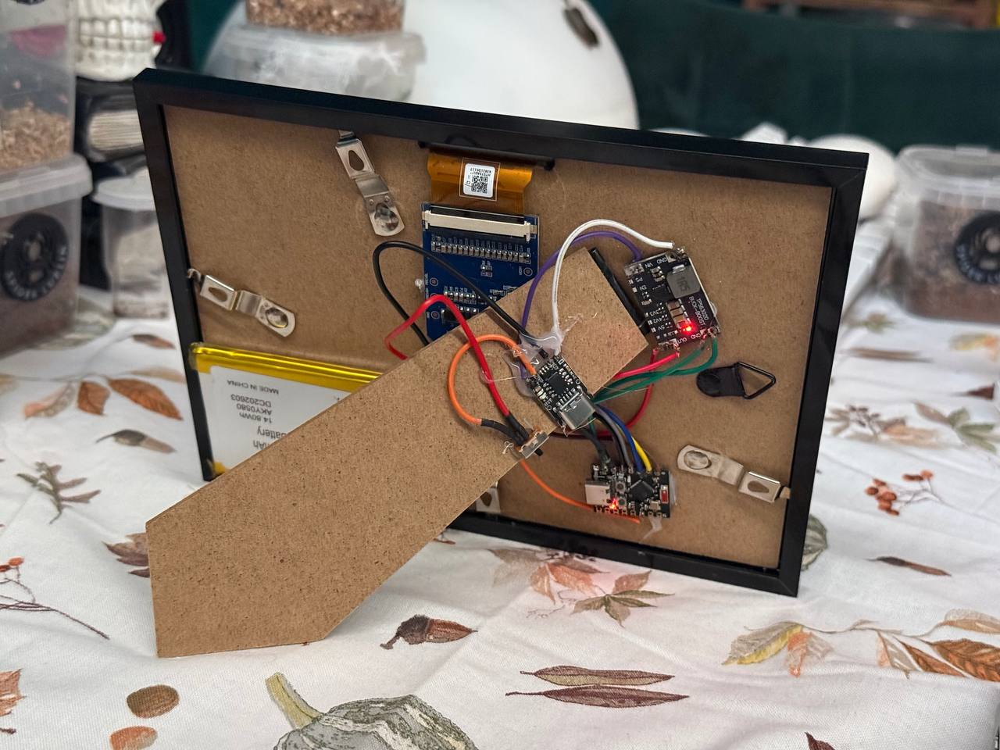
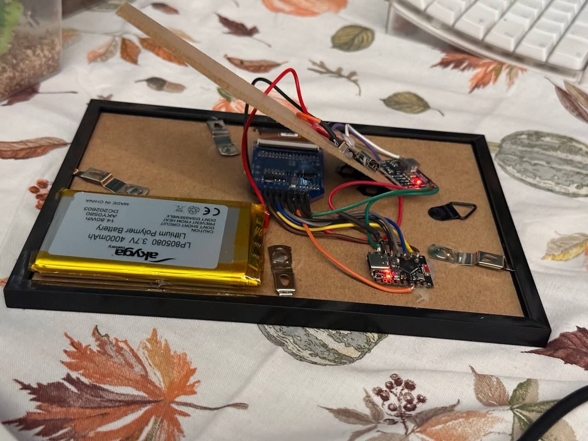
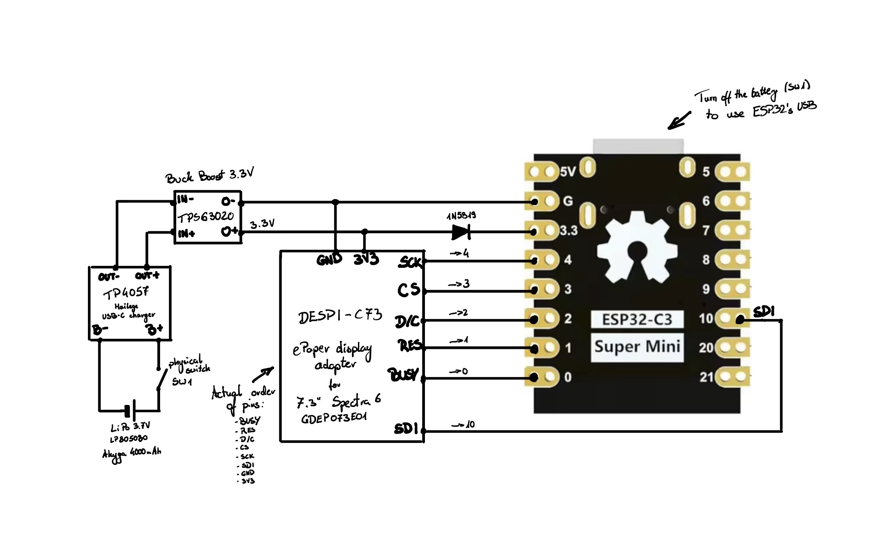

# ESP32 Spectra 6 ePaper Picture Frame

This is a little project of mine with a Picture Frame made with:

* an ESP32-C3 Super Mini,
* GDEP073E01 display (7.3" Spectra 6 display) with adapter board (DESPI-C73),
* a picture frame with additional frame for passe-partout,
* a 3.3V buck boost converter,
* a TP4057 USB-C charging module,
* a 4000mAh LiPo battery. 

The pictures are uploaded via Bluetooth (WiFi firmware is still in development).

The pictures need to be converted to raw Spectra 6 format (4bpp), I've used [this script by quark-zju](https://gist.github.com/quark-zju/e488eb206ba66925dc23692170ba49f9) and made [another script](./bmp_to_bin.py) that converts the output image to a proper 4bpp palette. The original script also outputs sp6 files with raw data, but unfortunately the palette is wrong for my display.

The battery should last about a month, but I'm still testing the frame and I'll update the estimate. For my calculations I've assumed the LED on the ESP32 and buck boost is lit continuously (to save the battery, you may unsolder those).

You may turn off the frame after uploading the picture to save battery. In this case, the battery may last up to a few years if you don't change the picture often.

## Picture uploader

The scripts were adapted as an HTML+JS tool: [ESP32 Picture Frame Uploader](https://multicatch.github.io/picture-frame/). You need Chrome (Mac, Windows, Android) or Bluefy (iOS) to use this tool.

The source code of this tool is here: [bluetooth/uploader](./bluetooth/uploader).

## Images

## Schematics

